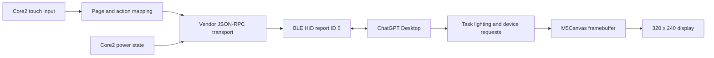

# M5Stack Codex Micro

[简体中文](README.zh-CN.md)

An independent, open-source compatibility firmware that turns an M5Stack
Core2, CoreS3, or StickS3 into a Bluetooth controller for Codex Micro features
in the ChatGPT desktop app.

The firmware presents the Core2 as a BLE vendor HID device and provides a
touchscreen interface for six Agent Keys, six Command Keys, four analog-stick
directions, and dial actions. Task status colors, battery state, command
remapping, and push-to-talk integration are handled by ChatGPT Desktop.

> [!IMPORTANT]
> This project is an unofficial compatibility implementation. It is not
> affiliated with, endorsed by, sponsored by, or supported by OpenAI, Work
> Louder, or M5Stack. It uses an undocumented vendor protocol that may change
> without notice. See [NOTICE.md](NOTICE.md) before using or redistributing it.

## Features

- Six touchscreen Agent Keys with task status colors and breathing animation
- Six default Command Keys: Fast, Approve, Decline, Fork, Mic, and Send
- Four touchscreen directions for actions assigned to the analog stick
- Dial counterclockwise, clockwise, press, and 500 ms hold behavior
- ChatGPT Desktop command and direction remapping
- Core2 battery reporting over BLE HID
- Automatic BLE advertising after disconnection
- Flicker-free 320 x 240 interface using a full-screen, PSRAM-backed `M5Canvas`

This is a vendor-control surface, not a general-purpose Bluetooth keyboard.

## Compatibility

| Component | Supported or tested state |
| --- | --- |
| Hardware | M5Stack Core2 tested on physical hardware; CoreS3 and the Tasks-only StickS3 target have dedicated build environments |
| Host OS | macOS tested |
| Host app | ChatGPT Desktop with Codex Micro support |
| Transport | Bluetooth Low Energy HID only |
| Build system | PlatformIO with Arduino framework |

The implementation was validated on physical Core2 hardware with ChatGPT
Desktop on July 16, 2026. Other Core2 revisions, other operating systems, USB
control, and Work Louder Input have not been validated.

## Requirements

- M5Stack Core2, CoreS3, or StickS3
- A data-capable USB-C cable for flashing
- [PlatformIO Core](https://docs.platformio.org/en/latest/core/index.html) or
  the PlatformIO IDE extension
- ChatGPT Desktop with Codex Micro support
- macOS Input Monitoring permission for ChatGPT

## Build and flash

The project defines three PlatformIO environments. `m5stack-cores3` is the
default; pass `-e m5stack-core2` or `-e m5stack-sticks3` for another target.

Clone the repository and run:

```sh
pio run -e m5stack-cores3
pio run -e m5stack-cores3 --target upload
pio device monitor
```

For the Tasks-only StickS3 firmware, use:

```sh
pio run -e m5stack-sticks3
pio run -e m5stack-sticks3 --target upload
```

PlatformIO installs the pinned ESP32 platform and the declared Arduino
libraries automatically. The serial monitor runs at `115200` baud. A successful
boot prints:

```text
CODEX_MICRO_READY
```

CoreS3 exposes the serial monitor over native USB CDC, so the port disappears
and re-enumerates on every reset.

The normal application binary is generated at:

```text
.pio/build/m5stack-cores3/firmware.bin
```

## Pair with ChatGPT Desktop

1. Flash the firmware and restart the Core2.
2. Open macOS Bluetooth settings and pair the device named **Codex Micro**.
3. Open ChatGPT Desktop. Allow **Input Monitoring** when macOS prompts for it.
4. Open **Settings > Codex Micro** after the device is detected.
5. Choose Agent Key assignments, Command Key actions, analog directions, and
   dial behavior. This firmware visualizes task status colors but does not
   reproduce the original keyboard's ambient or per-key lighting.

If macOS cached an older HID descriptor, forget **Codex Micro** in Bluetooth
settings, restart the Core2, and pair it again.

OpenAI's official Codex Micro usage documentation is available at
[learn.chatgpt.com](https://learn.chatgpt.com/docs/features/codex-micro).
Instructions specific to the original keyboard, including its USB mode,
physical pairing control, lighting hardware, and extra layers, do not apply to
this Core2 firmware.

## Controls

Core2's bottom A, B, and C touch buttons switch directly between the three
pages. CoreS3's digitizer stops at the bottom edge of the panel, so it has no
equivalent hardware buttons; use the on-screen tab bar instead.

### Tasks page

| Control | Behavior |
| --- | --- |
| Agent 1 to Agent 6 | Select the corresponding Codex task slot |
| Colored border and dot | Show the status color sent by ChatGPT Desktop |
| Breathing border | Show an animated status supplied by the host |

On StickS3, all six Agent states are shown in one compact list. Press `BtnB`
once to select the next Agent, double-press it within 350 ms to select the
previous Agent, or hold it for 500 ms to switch to the highlighted Agent. Press
`BtnA` once to emit Enter or double-press it within 350 ms to emit Right Alt.
The StickS3 build intentionally omits the Commands and Navigate pages.

### Commands page

| Key | Default ChatGPT Desktop action |
| --- | --- |
| Fast | Toggle Fast mode |
| Approve | Approve the current request |
| Reject | Decline the current request |
| New chat | Continue the thread in a new chat |
| Mic | Hold for push-to-talk; double-press behavior is handled by the host |
| Send | Send the composer message |

The Mic action uses the computer's microphone. The Core2 microphone is not
captured or streamed by this firmware.

### Navigate page

- `UP`, `RIGHT`, `DOWN`, and `LEFT` emulate the four analog-stick directions.
  Their sublabels show the host defaults: Plan mode, Forward, Sidebar, and Back.
- `CCW` and `CW` emulate one dial step in each direction.
- Tap `DIAL` to press the dial.
- Hold `DIAL` for at least 500 ms to request Codex Micro settings.

Mappings are selected in ChatGPT Desktop. Labels on the Core2 show the original
default layout and do not change after host-side remapping.

## Architecture



See [docs/TECHNICAL.md](docs/TECHNICAL.md) for the HID descriptor, report
framing, RPC methods, concurrency model, rendering path, and known protocol
limitations.

## Project layout

```text
include/CodexMicroBle.h   BLE transport and shared state declarations
src/CodexMicroBle.cpp     HID descriptor, framing, and RPC handling
src/main.cpp              Core2 UI, touch mapping, battery, and render loop
src/main_sticks3.cpp      StickS3 Tasks-only UI and button controls
docs/TECHNICAL.md         Implementation and protocol notes
platformio.ini            Reproducible PlatformIO environment
LICENSE                   MIT License
NOTICE.md                 Copyright, trademarks, and disclaimers
```

## Troubleshooting

### Device is not listed in Bluetooth settings

- Confirm the display header shows `PAIR`.
- Restart the Core2 and scan again.
- If it was paired previously, forget the old Bluetooth record first.

### ChatGPT Desktop does not detect the device

- Confirm macOS shows the device as connected.
- Quit and reopen ChatGPT Desktop after granting Input Monitoring.
- Open **System Settings > Privacy & Security > Input Monitoring** and ensure
  ChatGPT is enabled.
- Forget and re-pair the device if the firmware's HID descriptor changed.

### Display shows `Canvas allocation failed`

The full-screen 16-bit framebuffer could not be allocated. Restart the device.
If it persists, verify that the target is an M5Stack Core2 or CoreS3 with
working PSRAM and that the unmodified `m5stack-core2` or `m5stack-cores3`
PlatformIO board definition is used.

### Serial diagnostics

Use `pio device monitor`. Useful messages include BLE pairing status, host
connection state, received RPC method names, and emitted key actions. Do not
publish serial logs without checking them for environment-specific information.

## Security and limitations

- BLE pairing uses bonding with a no-input/no-output, "Just Works" flow. Pair
  only in a trusted environment.
- The firmware has no network client and does not contact OpenAI directly.
  Control events and battery state are sent to the paired host over Bluetooth.
- The vendor HID identifiers and protocol are used solely for compatibility and
  are not assigned to or owned by this project.
- Protocol compatibility may break after a ChatGPT Desktop update.
- Only one BLE host connection is supported at a time.
- The implementation does not reproduce the original keyboard's USB transport,
  physical keys, analog input, LEDs, extra layers, or firmware updater.

## Contributing

Issues and pull requests are welcome. When reporting a compatibility problem,
include the Core2 hardware revision, host OS version, ChatGPT Desktop version,
serial output with private information removed, and exact reproduction steps.

Keep protocol changes narrowly scoped and document whether they were observed,
inferred, or verified on hardware.

## License

Copyright (c) 2026 imliubo.

Source code and project documentation are licensed under the
[MIT License](LICENSE). Third-party product names, trademarks, protocol
identifiers, and dependencies remain the property of their respective owners
and are not granted under this license. See [NOTICE.md](NOTICE.md).
